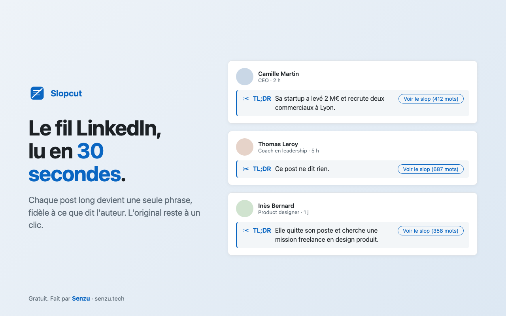

# Slopcut : LinkedIn en une phrase

Extension Chrome (Manifest V3, vanilla JS, zéro build) qui remplace le corps de chaque post LinkedIn long par une seule phrase générée **en local** par Gemini Nano. L'original reste à un clic. Aucune requête réseau, aucune télémétrie, aucune clé API.

Gratuit. Fait par [Senzu](https://senzu.tech/).

- Passation publication Chrome Web Store : [HANDOFF.md](HANDOFF.md)
- Politique de confidentialité : [PRIVACY.md](PRIVACY.md)
- Spécification d'origine : [docs/PRD.md](docs/PRD.md)

## Installation

1. Télécharger le dépôt (`git clone` ou « Code → Download ZIP », puis dézipper).
2. `chrome://extensions` → activer le **Mode développeur**.
3. **Charger l'extension non empaquetée** → sélectionner le dossier.
4. Cliquer sur l'icône Slopcut : si le popup affiche « Modèle à télécharger », cliquer sur **Télécharger Gemini Nano** (~4 Go, une seule fois). Le popup peut être fermé, Chrome continue le téléchargement.
5. Ouvrir (ou recharger) `https://www.linkedin.com/feed/`.

## Prérequis

- Chrome 138 minimum.
- Windows 10/11, macOS 13+, Linux ou Chromebook Plus.
- 22 Go d'espace libre sur le volume du profil Chrome.
- GPU avec plus de 4 Go de VRAM, ou CPU avec 16 Go de RAM et 4 cœurs.
- Connexion non limitée pour le premier téléchargement du modèle.

## Architecture

| Fichier | Rôle |
|---|---|
| `src/background.js` | Service worker : session Gemini Nano (Prompt API, fallback Summarizer), file à deux priorités (un prompt en vol, 40 max), timeout 15 s + 1 retry, cache LRU 500 entrées, compteurs. |
| `src/content.js` | Détection des cartes, extraction, UI Shadow DOM, keepalive, diagnostic. Ne touche jamais `LanguageModel`. |
| `src/selectors.js` | **Seul** endroit où vivent les sélecteurs LinkedIn. |
| `src/prompt.js` | System prompts (fr/en/es/de/ja × sec/cynique) et post-traitement de la sortie. |
| `src/settings.js` | Réglages partagés (défauts, lecture, options du modèle). |
| `src/hash.js` | Clé de cache FNV-1a sur auteur + texte normalisé. |
| `popup/` | État du modèle, téléchargement, ON/OFF, compteurs, réglages. |
| `store/` | Visuels, textes de fiche, script de packaging (`build.sh`). Hors extension. |

La clé de cache côté service worker est `hash|langue|ton` : changer de langue ou de ton ne ressert pas un résumé dans l'ancienne langue.

## Mettre à jour les sélecteurs

LinkedIn change son DOM régulièrement (et sert deux fronts différents selon les comptes). Tout est dans `src/selectors.js` :

- `POST_SELECTORS` : cartes de post. Testés dans l'ordre, le premier qui trouve au moins un élément devient actif jusqu'au prochain changement d'URL. Seules les cartes de premier niveau sont traitées (les `listitem` imbriqués sont des commentaires ou des repartages).
- `TEXT_SELECTORS` : corps du post, cherché **dans** la carte (le premier bloc qui n'est ni dans une carte imbriquée ni dans `COMMENT_SELECTORS`).
- `AUTHOR_SELECTORS`, `COMMENT_SELECTORS`, `SPONSORED_MARKERS`, `SEE_MORE_LABELS`.

Pour simuler l'ancien markup sur un compte qui n'a que le nouveau (ou inversement), réordonner `POST_SELECTORS`, puis recharger l'extension et l'onglet.

## Diagnostic et logs

- **Diagnostic sélecteurs** : sur `/feed/`, si aucune carte n'est détectée 6 s après l'arrivée, la console de l'onglet LinkedIn affiche `[slopcut] DIAGNOSTIC` avec la liste des attributs `data-*` présents sous `main` (noms uniquement, jamais de contenu).
- **Logs détaillés** : tous les logs `[slopcut]` sont au niveau `debug`. Activer le niveau **Verbose** dans la console :
  - onglet LinkedIn → logs du content script (`cache hit`, `request lost`, etc.) ;
  - `chrome://extensions` → Slopcut → **service worker** → logs de la file (`enqueue`, `prompt start`, `summary`, `cache hit`, `dropped`).

## Écarts assumés par rapport au PRD

- `src/settings.js` ajouté (et listé dans `web_accessible_resources`) pour partager les défauts entre SW, content script et popup.
- Diffusion des réglages aux onglets via `chrome.storage.onChanged` plutôt que `chrome.tabs.sendMessage` (même effet, pas besoin de lister les onglets).
- Navigation SPA : un content script vit dans un monde isolé et ne peut pas patcher le `history.pushState` de la page. Détection via Navigation API (`navigatesuccess`), `popstate` et comparaison de `location.href` à chaque scan.
- SW arrêté pendant un prompt : le PING toutes les 20 s renvoie les requêtes que le SW connaît encore ; une requête inconnue depuis plus de 20 s est renvoyée une fois, puis l'original est restauré.
